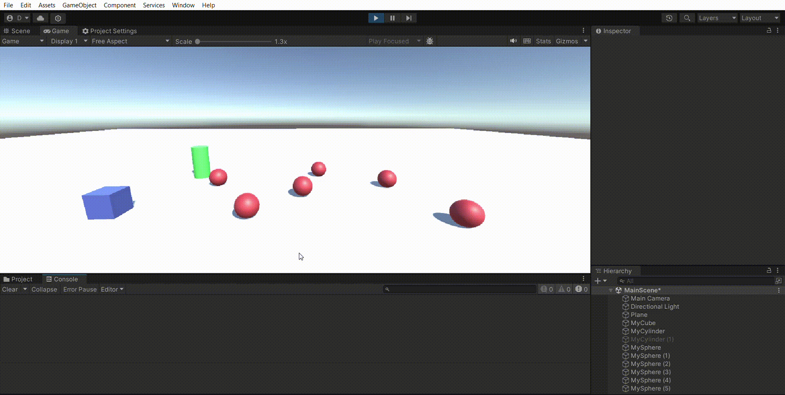
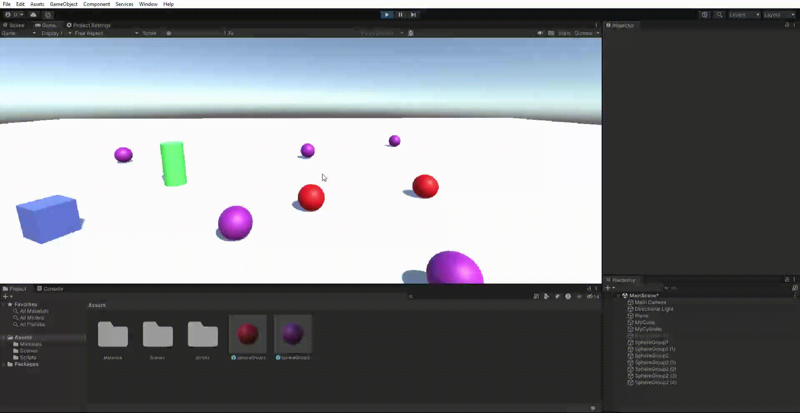
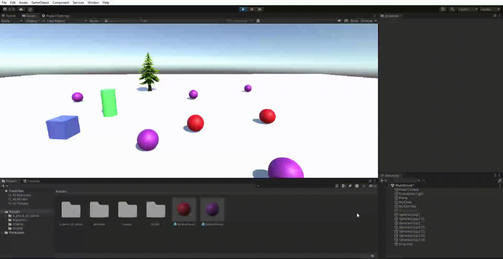
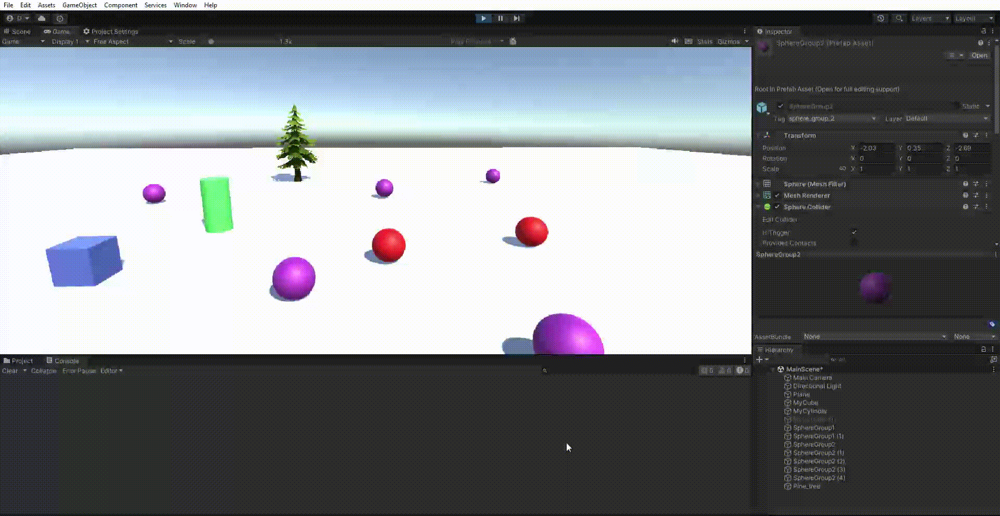
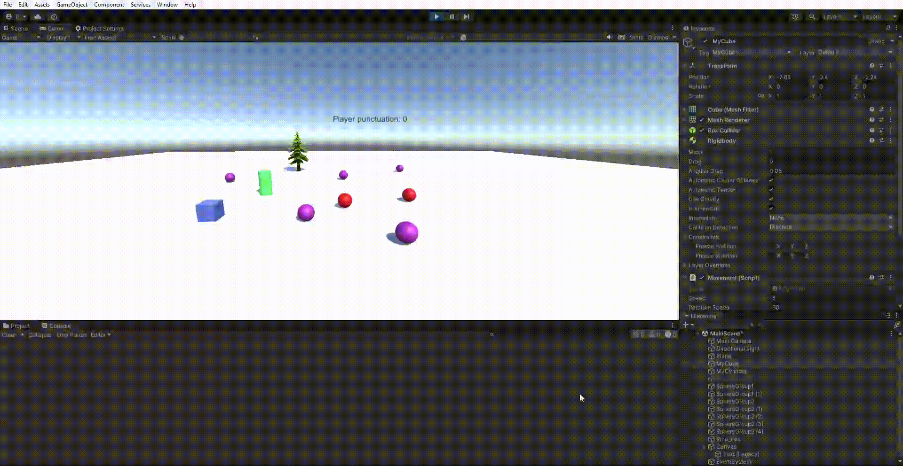

# II-P04-Events

Para esta práctica hemos trabajado con diferentes eventos y delegados, usado prefabs y aplicado muchas de las cosas aprendidas en las prácticas 2 y 3 sobre movimiento y físicas.

A continuación se mostrará el resultado de cada ejercicio con un GIF.

## Ejercicio 1

## Ejercicio 2

## Ejercicio 3

## Ejercicio 4

## Ejercicio 5

## Ejercicio 6

